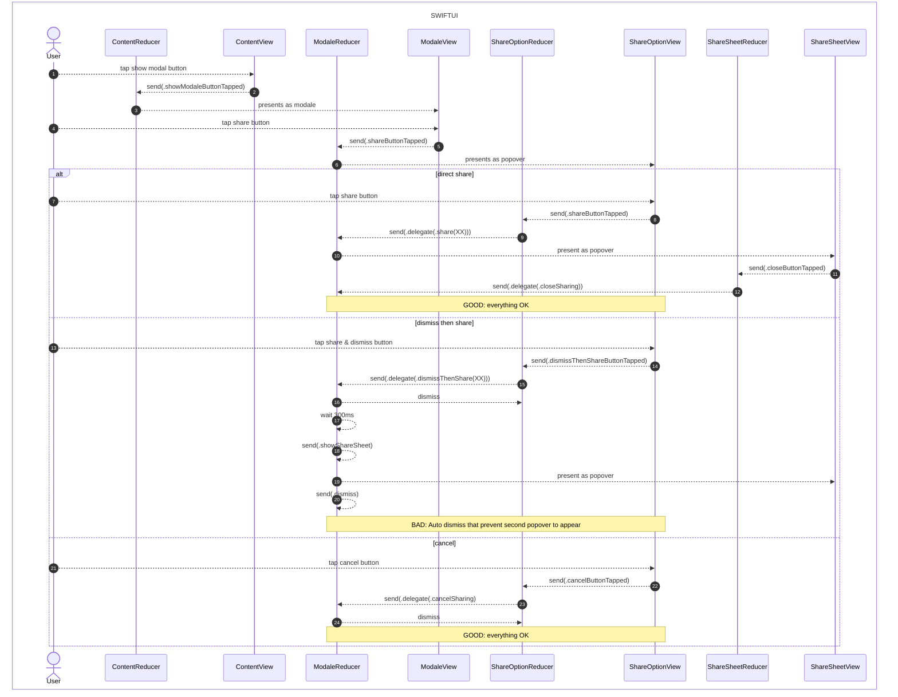
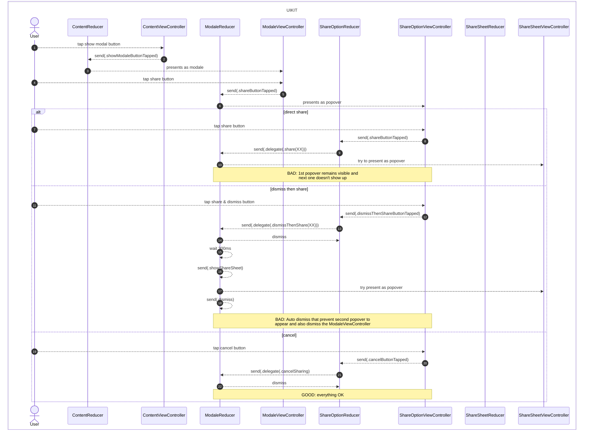

# DoubleModaleShowCase
Showcase the double modal presentation issue in SwiftUI and UIKit with TCA

At the time of writing, the issue is still present in TCA 1.15.2.

This issue is discussed in the following thread: https://github.com/pointfreeco/swift-composable-architecture/discussions/3371#discussioncomment-10619643

## Description

This project is a showcase of a bug that occurs when you present a modale and then present a popover over a popover from that modale, the behavior of SwiftUI and UIKit are not consistent.
Two usecases are tested in this project for both UIKit and SwiftUI navigation:
    1. Setting the second popover directly over the first one
    2. Dismissing the first one, waiting 300ms then presenting the second one.
    
In usecase 1, the UIKit navigation will not present the second popover, while the SwiftUI navigation will present it correctly.
In usecase 2, the UIKit navigation will dismiss the second popover before it is displayed and also dismiss the modale view controller, while the SwiftUI navigation will dismiss the second popover before it is shown but keep the modale.

## Project demo

https://github.com/user-attachments/assets/a15dfbf6-3a5c-494f-9627-e95b00d99777

## Issue

See below the sequence diagrams that illustrate the issue for both SwiftUI and UIKit navigation.

### SwiftUI

### UIKit

## Workaround

I finally found a workaround to this issue. In fact, the waiting time between the dismiss of the first popover and the presentation of the second one is the key to the issue. If you wait a little bit more before presenting the second popover, the UIKit navigation will work as expected. 

**Waiting 300ms was too little so I tried increasing the value and found that 1sec was working fine**. 

The current version of the repo is reflecting this change.

